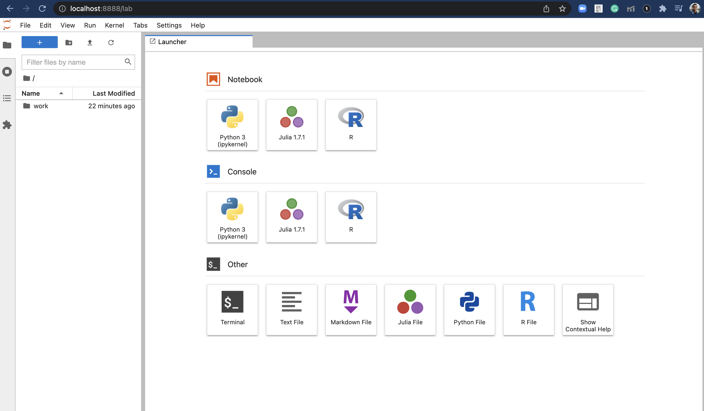
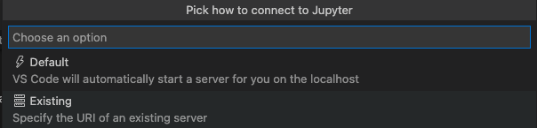
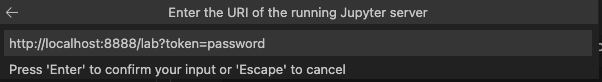
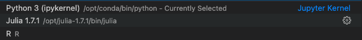

# Running your dockerized jupyter notebook on Visual Studio Code.


I want to give here an end to end steps on how to run your dockerized jupyter notebook server on visual studio code so you can get the best of both worlds. 


## Getting jupyter notebook running on docker

1- Create a new directory where you will use to save your notebooks.


2- Create a file under the name of docker-compose.yml and paste the following syntax inside. This will create a docker compose file with docker image built by jupyter, you can learn more about the image from [docker hub]( https://hub.docker.com/r/jupyter/datascience-notebook/)

```
version: "3.7" 
services:
  datascience-demo:
      image: jupyter/datascience-notebook
      environment: 
        - JUPYTER_TOKEN=password  
      volumes:
        - ./:/home/jovyan/work 
      ports:
        - 8888:8888
      container_name:   datascience-notebook-container
``` 

3- in termainal navigate to the directory you've created and run the following comand  
``` 
docker-compose up -d 
```

This will take few mintues the first time you run it as it will download the needed files and make the necessary setup 


4- open the browser and type http://localhost:8888/lab?token=password

You should get jupyterlab running like below: 




For a step by step video guide please refer to this very useful
[Reference video](https://www.youtube.com/watch?v=uIipJX7TfBw)


## Connect your jupyter server to VS Code 

Congrats now you're able to connect to jupyter lab in a docker image, now let's see how to connect this to vs code to use the same kernels that is in our docker image. I will assupe that you have jupyter exentions already setup on VsCode. 


1- Click **F1** to show all comands
2- Choose **Python: Specify local or remote Jupyter server for connections**


3- Then select **Existing**




4- Finally add the URL http://localhost:8888/lab?token=password to the URL Link like below:




Now your kernels will read from the dockerized jupyter servers 


Reference [Connect to a JupyterHub from Visual Studio Code
](https://blog.jupyter.org/connect-to-a-jupyterhub-from-visual-studio-code-ed7ed3a31bcb)